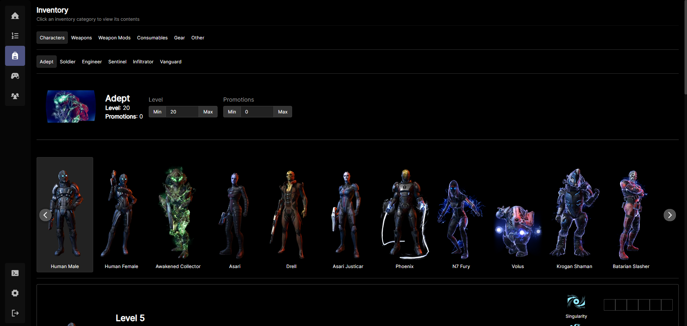
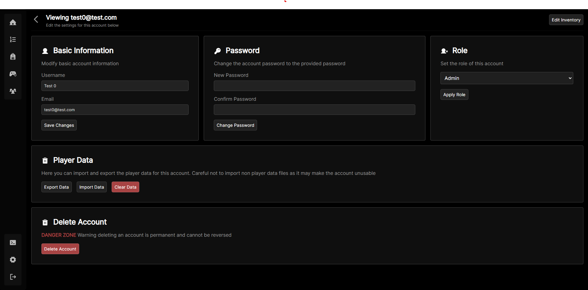
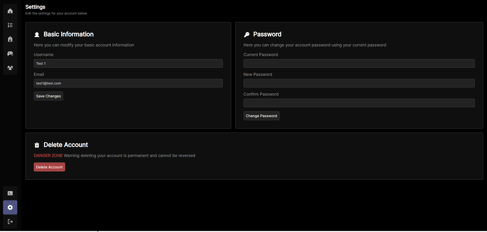

# Pocket Relay Dashboard

This is the dashboard that is embedded into **Pocket Relay** servers

> Mass Effect is a registered trademark of Bioware/EA International (Studio and Publishing), Ltd in the U.S. and/or other countries. All Mass Effect art, images, and lore are the sole property of Bioware/EA International (Studio and Publishing), Ltd and have been reproduced here in an effort to assist the Mass Effect player community. All other trademarks are the property of their respective owners.

## Features

- User management
- Account creation, editing, and deletion
- Leaderboards
- Player data editing
- Player data importing, exporting, clearing, and editing
- Server log management
- Sending in-game login codes (Requires users on plugin client)

## 📸 Screenshots










## ⚒ Developing

Once you've created a project and installed dependencies with `npm install` (or `pnpm install` or `yarn`), start a development server:

```bash
npm run dev

# or start the server and open the app in a new browser tab
npm run dev -- --open
```

Make sure to create a `.env.development` file with the `VITE_SERVER_URL` set to the local server for developing against:

```env
VITE_SERVER_URL=http://localhost/api/
```

## 🚀 Building

To create a production version of your app:

```bash
npm run build
```

You can preview the production build with `npm run preview`.

## 🧾 License

MIT License

Copyright (c) 2023 Jacobtread

Permission is hereby granted, free of charge, to any person obtaining a copy
of this software and associated documentation files (the "Software"), to deal
in the Software without restriction, including without limitation the rights
to use, copy, modify, merge, publish, distribute, sublicense, and/or sell
copies of the Software, and to permit persons to whom the Software is
furnished to do so, subject to the following conditions:

The above copyright notice and this permission notice shall be included in all
copies or substantial portions of the Software.

THE SOFTWARE IS PROVIDED "AS IS", WITHOUT WARRANTY OF ANY KIND, EXPRESS OR
IMPLIED, INCLUDING BUT NOT LIMITED TO THE WARRANTIES OF MERCHANTABILITY,
FITNESS FOR A PARTICULAR PURPOSE AND NONINFRINGEMENT. IN NO EVENT SHALL THE
AUTHORS OR COPYRIGHT HOLDERS BE LIABLE FOR ANY CLAIM, DAMAGES OR OTHER
LIABILITY, WHETHER IN AN ACTION OF CONTRACT, TORT OR OTHERWISE, ARISING FROM,
OUT OF OR IN CONNECTION WITH THE SOFTWARE OR THE USE OR OTHER DEALINGS IN THE
SOFTWARE.
